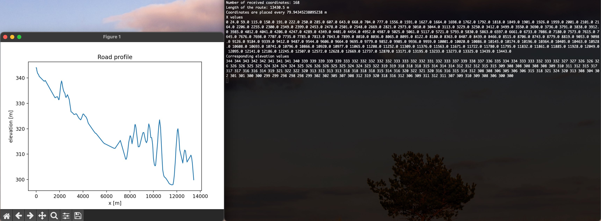

# PyRouteElevationProfile

PyRouteElevationProfile is a command line tool used to obtain elevation of route.
Start point and end point are required for the script to calculate the best route by car and return the elevation profile.
Additionally, the road profile can be plotted.

## Features

* Get road elevation between two points
* Plot the results
* Result is printed to the console and can be used for later processing e.g. in MATLAB
* Modify the script to your needs! :)

## Before you start

The script requires free API key that should be obtained from [Openrouteservice](https://openrouteservice.org/dev/#/home)

## Quick Start

Firstly, download the script from this repository

Run the script

    python PyRouteElevationProfile.py -slat 49.72037999582303 -slng 19.980357561386278 -elat 49.820465778926604 -elng 19.93733261706287 -p 1 -k {YOURAPIKEY}

Alternative parameter names

    python PyRouteElevationProfile.py --startlatitude 49.72037999582303 --startlongitude 19.980357561386278 --endlatitude 49.820465778926604 --endlongitude 19.93733261706287 --plot 1 -secretkey {YOURAPIKEY}

## Example output

## Resources

* [Openrouteservice python library docs](https://openrouteservice-py.readthedocs.io/en/latest/)
* [Openrouteservice maps - plan your route](https://maps.openrouteservice.org/)
